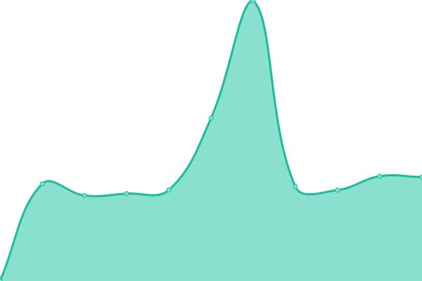
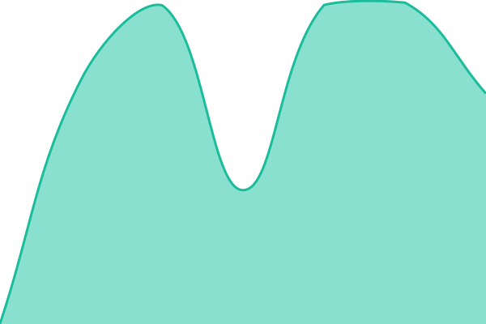
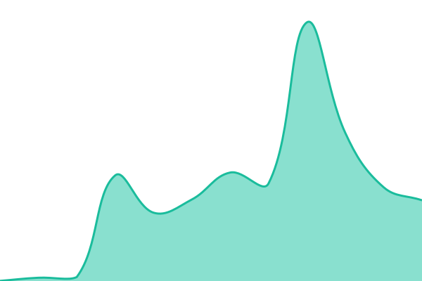
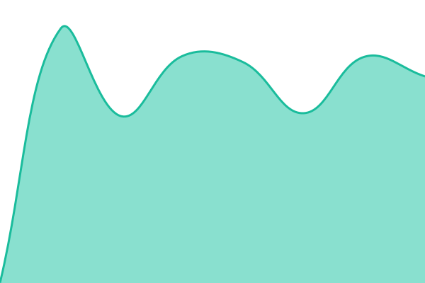
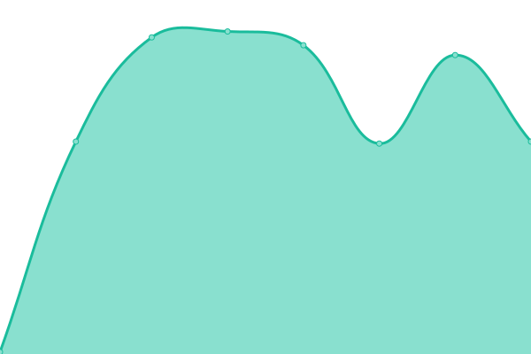

# [📈 Live Status](https://jason-xy.cn/upptime): <!--live status--> **🟩 All systems operational**

This repository contains the open-source uptime monitor and status page for [XU Yang](https://jason-xy.cn), powered by [Upptime](https://github.com/upptime/upptime).

With [Upptime](https://upptime.js.org), you can get your own unlimited and free uptime monitor and status page, powered entirely by a GitHub repository. We use [Issues](https://github.com/jason-xy/upptime/issues) as incident reports, [Actions](https://github.com/jason-xy/upptime/actions) as uptime monitors, and [Pages](https://jason-xy.cn/upptime) for the status page.

<!--start: status pages-->
<!-- This summary is generated by Upptime (https://github.com/upptime/upptime) -->
<!-- Do not edit this manually, your changes will be overwritten -->
<!-- prettier-ignore -->
| URL | Status | History | Response Time | Uptime |
| --- | ------ | ------- | ------------- | ------ |
|  [UAV-Group Website](https://uav.hkust.edu.hk) | 🟩 Up | [uav-group-website.yml](https://github.com/Jason-xy/upptime/commits/HEAD/history/uav-group-website.yml) | 

 2718ms
     
 | 

<a href="https://uptime.jason-xy.cn/history/uav-group-website">96.78%</a>
    

|  [UAV-Group NAS](https://dsm.hkust-uav.org) | 🟩 Up | [uav-group-nas.yml](https://github.com/Jason-xy/upptime/commits/HEAD/history/uav-group-nas.yml) | 

 2128ms
     
 | 

<a href="https://uptime.jason-xy.cn/history/uav-group-nas">100.00%</a>
    

|  [UAV-Group Overleaf Server](https://latex.hkust-uav.org) | 🟩 Up | [uav-group-overleaf-server.yml](https://github.com/Jason-xy/upptime/commits/HEAD/history/uav-group-overleaf-server.yml) | 

 1333ms
     
 | 

<a href="https://uptime.jason-xy.cn/history/uav-group-overleaf-server">100.00%</a>
    

|  [UAV-Group Artifactory Server](https://repo.hkust-uav.org) | 🟩 Up | [uav-group-artifactory-server.yml](https://github.com/Jason-xy/upptime/commits/HEAD/history/uav-group-artifactory-server.yml) | 

 788ms
     
 | 

<a href="https://uptime.jason-xy.cn/history/uav-group-artifactory-server">100.00%</a>
    

|  [UAV-Group LLM Router](https://sub2api.hkust-uav.org) | 🟩 Up | [uav-group-llm-router.yml](https://github.com/Jason-xy/upptime/commits/HEAD/history/uav-group-llm-router.yml) | 

 976ms
     
 | 

<a href="https://uptime.jason-xy.cn/history/uav-group-llm-router">100.00%</a>
    

|  [Personal NAS - frpc](hk.hkust-uav.org) | 🟩 Up | [personal-nas-frpc.yml](https://github.com/Jason-xy/upptime/commits/HEAD/history/personal-nas-frpc.yml) | 

 202ms
     
 | 

<a href="https://uptime.jason-xy.cn/history/personal-nas-frpc">100.00%</a>
    

|  [Personal NAS - ugid](https://zyh-xy.aar4.ug.link) | 🟩 Up | [personal-nas-ugid.yml](https://github.com/Jason-xy/upptime/commits/HEAD/history/personal-nas-ugid.yml) | 

 6589ms
     
 | 

<a href="https://uptime.jason-xy.cn/history/personal-nas-ugid">100.00%</a>
    

|  [Personal Website](https://jason-xy.cn) | 🟩 Up | [personal-website.yml](https://github.com/Jason-xy/upptime/commits/HEAD/history/personal-website.yml) | 

 307ms
     
 | 

<a href="https://uptime.jason-xy.cn/history/personal-website">100.00%</a>
    

|  [Proxy Server](https://jp.hkust-uav.org) | 🟩 Up | [proxy-server.yml](https://github.com/Jason-xy/upptime/commits/HEAD/history/proxy-server.yml) | 

 503ms
     
 | 

<a href="https://uptime.jason-xy.cn/history/proxy-server">100.00%</a>
    

|  [RustDesk Server](rustdesk.hkust-uav.org) | 🟩 Up | [rust-desk-server.yml](https://github.com/Jason-xy/upptime/commits/HEAD/history/rust-desk-server.yml) | 

 203ms
     
 | 

<a href="https://uptime.jason-xy.cn/history/rust-desk-server">100.00%</a>
    

<!--end: status pages-->

[**Visit our status website →**](https://jason-xy.cn/upptime)

## 📄 License

- Powered by: [Upptime](https://github.com/upptime/upptime)
- Code: [MIT](./LICENSE) © [Anand Chowdhary](https://anandchowdhary.com), supported by [Pabio](https://pabio.com)
- Data in the `./history` directory: [Open Database License](https://opendatacommons.org/licenses/odbl/1-0/)
